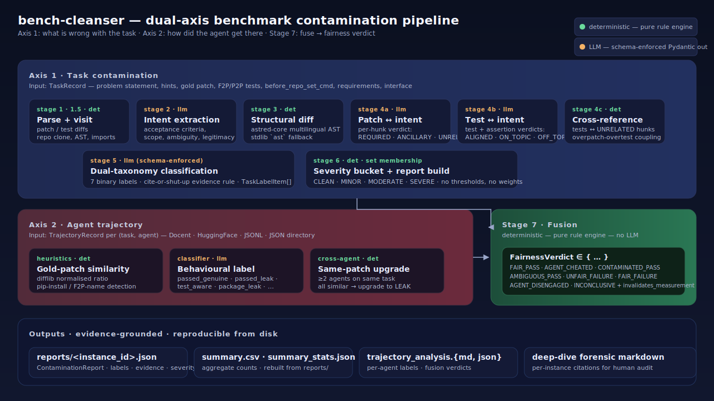
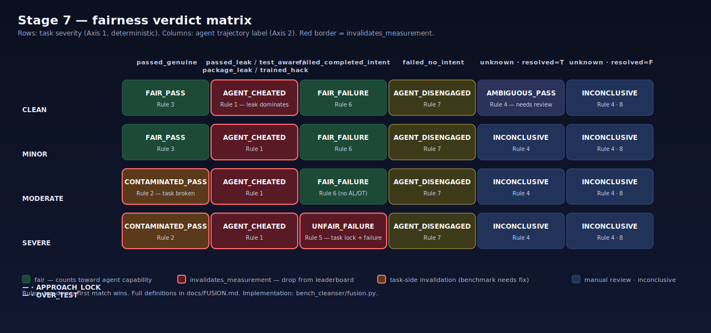

<div align="center">

# bench-cleanser

**Deterministic, evidence-grounded contamination, fairness, and trajectory-leakage analysis for the SWE-bench family of benchmarks.**

*A research instrument for the people building, training on, and grading agentic coding LLMs.*

<p>
  <a href="https://github.com/v-liaozhu/bench-cleanser/actions/workflows/ci.yml"></a>
  <a href="https://www.python.org/downloads/"></a>
  <a href="LICENSE"></a>
  
  
</p>

<p>
  <a href="https://docs.astral.sh/ruff/"></a>
  <a href="https://mypy.readthedocs.io/"></a>
  <a href="https://docs.pydantic.dev/"></a>
  <a href="https://platform.openai.com/docs/guides/structured-outputs"></a>
  <a href="https://github.com/swe-bench/SWE-bench"></a>
  <a href="https://docent.transluce.org/"></a>
</p>



</div>

---

> **Why does this exist?** The SWE-bench family is the de-facto benchmark for evaluating, and increasingly for training, coding agents. The numbers a leaderboard reports answer *"did this row pass"* — they do **not** answer *"was passing this row a real measurement of capability."* `bench-cleanser` makes that second question machine-checkable, at scale, with citations.
>
> If you train or RLHF an agent on SWE-bench rows, every contaminated task you keep teaches the model the wrong lesson. If you publish numbers against it, every contaminated row inflates or deflates the score in ways your audience can't audit. This is the tool you run before either.

---

## Table of contents

- [Positioning](#positioning) · what this is and is not
- [The two-axis model](#the-two-axis-model)
- [Architecture at a glance](#architecture-at-a-glance)
- [Fairness verdict matrix](#fairness-verdict-matrix-stage-7)
- [Taxonomy reference](#taxonomy-reference)
- [Install](#install)
- [Quickstart](#quickstart) · 60-second pipeline run
- [CLI reference](#cli-reference)
- [Outputs — what comes out of a run](#outputs--what-comes-out-of-a-run)
- [Trajectory infrastructure](#trajectory-infrastructure)
- [SWE-bench ecosystem coverage](#swe-bench-ecosystem-coverage)
- [Reproducibility & determinism contract](#reproducibility--determinism-contract)
- [LLM transport — the spare-no-cost layer](#llm-transport--the-spare-no-cost-layer)
- [Portability & the import contract](#portability--the-import-contract)
- [Configuration](#configuration)
- [Quality controls & CI](#quality-controls--ci)
- [Repository layout](#repository-layout)
- [Known limits & honest caveats](#known-limits--honest-caveats)
- [Citing & related work](#citing--related-work)
- [Documentation index](#documentation-index)
- [License](#license)

---

## Positioning

`bench-cleanser` is a **research instrument**, not a metric.

**What it does.** Given a SWE-bench-style row (task description + gold patch + F2P/P2P tests + optional `before_repo_set_cmd` + optional agent trajectory), it emits a typed, evidence-linked report covering:

1. *What is broken about the benchmark item itself* (Axis 1).
2. *How the agent reached its result* (Axis 2).
3. *Whether the resulting pass/fail is a fair measurement of capability* (Stage 7).

**What it does not do.**

- It does not score models. It produces verdicts and `invalidates_measurement` flags so *your* scoring policy can ignore the rows it can't trust.
- It does not replace human review. It makes human review tractable — every label cites the line, hunk, or assertion that produced it.
- It does not patch SWE-bench. Cleaning, regenerating, or discarding contaminated tasks is the maintainer's decision; this tool only labels.

**Who it's for.** Benchmark maintainers, model evaluators, training-data curators for code LLMs, and the auditors trying to figure out which leaderboard cell actually corresponds to capability.

---

## The two-axis model

The central design choice is that **task quality and agent behaviour are independent dimensions** and must be tagged separately before they are fused.

| | Axis 1 — task contamination | Axis 2 — agent trajectory |
|---|---|---|
| **Asks** | Is the benchmark item fair? | How did this agent reach its answer? |
| **Cardinality** | Multi-label over 7 binary labels (or `CLEAN`) | Single label per `(task, agent)` |
| **Inputs** | Problem text, gold patch, F2P / P2P tests, `before_repo_set_cmd`, requirements, interface | Trajectory actions, `final_patch`, agent's reported `resolved` flag |
| **Module** | `bench_cleanser.classification.dual_taxonomy` | `bench_cleanser.trajectory.classifier` |
| **Determinism** | LLM-assisted labelling + deterministic severity bucketing | Heuristics + LLM, with deterministic cross-agent upgrade |

These axes serve different consumers. An `APPROACH_LOCK` task is broken whether or not any model attempts it. An agent that `pip install`s the fix has cheated whether or not the task is clean. Only **Stage 7** combines them into a single, consumer-ready `FairnessVerdict`.

### Alignment with OpenAI's Verified audit (Apr 2026)

The taxonomy was deliberately aligned with the categories OpenAI used in their public SWE-bench Verified critique:

| OpenAI term | `bench-cleanser` label |
| --- | --- |
| "Narrow test cases" | `APPROACH_LOCK` |
| "Wide test cases" | `OVER_TEST` |

The deeper insight encoded in the severity rules — that the gold patch and the F2P tests are **co-authored by the same PR submitter**, so wide tests are rarely innocent — comes from that same audit and is the reason `OVER_TEST` alone is `SEVERE`.

---

## Architecture at a glance

```mermaid
flowchart LR
    classDef det fill:#0e2218,stroke:#2d6a4f,color:#e7ecff,font-size:12px
    classDef llm fill:#3d2a14,stroke:#f4b266,color:#e7ecff,font-size:12px
    classDef io  fill:#0f1530,stroke:#22345e,color:#e7ecff,font-size:12px

    T[TaskRecord] --> S1[Stage 1·1.5 — parse + visit<br/>diffs · repo clone · AST]:::det
    S1 --> S2[Stage 2 — intent extraction]:::llm
    S1 --> S3[Stage 3 — structural diff<br/>astred-core / ast fallback]:::det
    S2 --> S4A[Stage 4A — patch ↔ intent]:::llm
    S2 --> S4B[Stage 4B — test ↔ intent]:::llm
    S3 --> S4A
    S3 --> S4B
    S4A --> S4C[Stage 4C — cross-reference<br/>overpatch · overtest coupling]:::det
    S4B --> S4C
    S4C --> S5[Stage 5 — dual-taxonomy classification<br/>schema-enforced LLM]:::llm
    S5 --> S6[Stage 6 — severity bucket<br/>set membership · no thresholds]:::det
    S6 --> R[(ContaminationReport)]:::io

    TR[TrajectoryRecord<br/>Docent · HF · JSONL] --> TC[Trajectory classifier<br/>heuristics + LLM]:::llm
    TC --> CA[Cross-agent upgrade<br/>same final patch ⇒ leak]:::det

    R --> F7[Stage 7 — fusion<br/>deterministic rule engine]:::det
    CA --> F7
    F7 --> V[(FairnessVerdict<br/>+ invalidates_measurement)]:::io
```



The same architecture, in higher-fidelity, is the SVG at the top of this README.

---

## Fairness verdict matrix · Stage 7



Eight verdicts. Three flag the agent (`AGENT_CHEATED`, `AGENT_DISENGAGED`, `AMBIGUOUS_PASS`). Three flag the task (`CONTAMINATED_PASS`, `UNFAIR_FAILURE`). Two are clean signals (`FAIR_PASS`, `FAIR_FAILURE`). One is escape-hatch (`INCONCLUSIVE`).

Every verdict ships with `reasoning`, an `evidence: list[str]`, and an `invalidates_measurement: bool` — the single boolean a downstream consumer should use to decide whether to drop a row from a leaderboard.

Full rule set with worked examples: [`docs/FUSION.md`](docs/FUSION.md). Implementation: [`bench_cleanser/fusion.py`](bench_cleanser/fusion.py).

---

## Taxonomy reference

### Axis 1 · Task contamination (7 labels, multi-label except `CLEAN`)

| Label | Triggers when… | Severity contribution |
|---|---|---|
| `APPROACH_LOCK` | F2P tests assert on a specific implementation strategy, not observable behaviour. | **SEVERE** |
| `OVER_TEST` | F2P tests assert on behaviour the spec never described, or were modified to do so. | **SEVERE** (PR-authorship realism) |
| `OVER_PATCH` | Gold patch modifies behaviour not described in the problem (changes runtime, not just imports). | MINOR alone; MODERATE with hidden/unclear |
| `UNCLEAR_DESCRIPTION` | Spec is ambiguous enough that multiple incompatible solutions are reasonable. | MINOR |
| `HIDDEN_CONTEXT` | Problem framing relies on cues not actionable from the issue text alone (e.g. *"see the patch"*). | MINOR |
| `WEAK_COVERAGE` | F2P tests don't actually exercise the patched code paths. | MINOR |
| `CLEAN` | None of the above apply. Emitted as a single exclusive label. | — |

### Severity is set-membership — no floats anywhere

```
SEVERE   := APPROACH_LOCK ∈ labels  OR  OVER_TEST ∈ labels
MODERATE := OVER_PATCH ∈ labels AND (HIDDEN_CONTEXT ∈ labels OR UNCLEAR_DESCRIPTION ∈ labels)
MINOR    := any contamination label set that is neither SEVERE nor MODERATE
CLEAN    := labels = ∅  OR  labels = { CLEAN }
```

Reproducible from the persisted report alone, frozen across LLM upgrades. See [`docs/TAXONOMY.md`](docs/TAXONOMY.md).

### Axis 2 · Agent trajectory (1 label per `(task, agent)`)

| Outcome | Label | Pattern |
|---|---|---|
| **Passed** | `agent_passed_genuine` | Explore → hypothesise → patch → test. Diverges from gold but solves the brief. |
|  | `agent_passed_leak` | Final patch ≥ 0.90 similar to gold; trajectory shows direct file/function jumps. |
|  | `agent_passed_package_leak` | Agent `pip install`ed the affected package and lifted the fix from site-packages. |
|  | `agent_passed_test_aware` | Agent referenced F2P test names or values before they were derivable from exploration. |
|  | `agent_passed_trained_hack` | Canonical fix on first try, no debug steps — memorised template. |
| **Failed** | `agent_failed_completed_intent` | Patch addresses the described behaviour but F2P tests reject it. Driver for `UNFAIR_FAILURE`. |
|  | `agent_failed_no_intent` | Agent never engaged the problem. Skill gap, not benchmark issue. |
| **Unknown** | `agent_unknown` | Trajectory truncated, malformed, or otherwise insufficient. |

---

## Install

```bash
git clone https://github.com/v-liaozhu/bench-cleanser.git
cd bench-cleanser
pip install -e ".[dev]"
```

Optional extras pull in heavier dependencies only when you need them:

| Extra | Adds | Use when |
|---|---|---|
| `.[trajectory]` | `docent-python` | You want first-class Docent trajectory ingestion. |
| `.[structural]` | `astred-core` | You want the .NET-backed multilingual AST diff (Python/JS/TS/Go). The pipeline falls back transparently to stdlib `ast` when missing. |
| `.[dev]`        | `pytest`, `pytest-asyncio`, `pytest-cov`, `ruff`, `mypy` | You are contributing or running CI locally. |

**Auth.** The LLM client uses CloudGPT (Azure OpenAI) via Azure AD. Have `az login` available; tokens are acquired, cached for ~50 min, and reacquired automatically on 401. No PAT or static key configuration is required.

**Python.** Officially supported: **3.11** and **3.12** (matrix-tested in CI on Ubuntu).

---

## Quickstart

```bash
# 1) Contamination pipeline — first 50 SWE-bench Pro tasks
bench-cleanser --dataset pro --max-tasks 50 --output out/pro

# 2) Layer per-agent trajectory + Stage-7 fusion onto those reports
bench-cleanser-trajectory \
    --reports-dir out/pro/reports \
    --trajectory-source <docent-uuid|hf-dataset|trajectories.jsonl|trajectories_dir/> \
    --output out/pro/trajectory_analysis.md

# 3) Forensic deep-dive markdown for every SEVERE case
bench-cleanser-deep-dive \
    --reports-dir out/pro/reports \
    --severity SEVERE \
    --output out/pro/deep_dive_severe.md
```

A full 500-task Verified run with `reasoning_effort=high` and `concurrency=10` lands in roughly 1 – 2 h of wall-clock and resumes cleanly after interruption (`--resume` is the default; opt out with `--no-resume`).

For a no-LLM-cost peek at what the outputs look like, see [`examples/sample_run/`](examples/sample_run/).

---

## CLI reference

Three canonical console scripts, declared in `pyproject.toml [project.scripts]`:

| Command | Purpose | Entry point |
| --- | --- | --- |
| `bench-cleanser` | Contamination pipeline (Stages 1 – 6). | `bench_cleanser.cli:main` |
| `bench-cleanser-trajectory` | Trajectory ingestion + Stage-7 fusion. | `bench_cleanser.cli:trajectory_main` |
| `bench-cleanser-deep-dive` | Per-instance forensic markdown. | `bench_cleanser.cli:deep_dive_main` |

Each command exposes `--help` for the full flag list. The legacy `run_pipeline.py` / `run_trajectory_analysis.py` / `run_deep_dive.py` shims at the repo root remain for backwards-compat — **prefer the console-script names**, they survive `pip install --upgrade`.

Selected flags worth knowing:

- `--dataset {verified,pro,live,both}` — which split to load via `bench_cleanser.data_loader`.
- `--instance-id <id>` — analyse a single row; overrides `--dataset`.
- `--resume` / `--no-resume` — defaults to **on**; per-instance reports on disk are reused.
- `--concurrency N` — task-level parallelism; LLM-call concurrency is configured separately via `max_concurrent_requests`.
- `--severity {CLEAN,MINOR,MODERATE,SEVERE}` — filter for the trajectory and deep-dive commands.

---

## Outputs — what comes out of a run

A run targeting `--output out/<name>` produces an audit-grade tree:

```text
out/<name>/
├── reports/                      one JSON per instance — the source of truth
│   └── instance_<repo>__<sha>.json
├── summary.csv                   per-instance rows: severity + label flags + counts
├── summary_stats.json            aggregate distributions, rebuilt from reports/
├── trajectory_analysis.md        per-agent labels + fusion verdicts (markdown)
└── trajectory_analysis.json      machine-readable analyses + fusion records
```

**Per-instance JSON shape (excerpt):**

```json
{
  "instance_id": "ansible__ansible-3889ddeb…",
  "severity": "SEVERE",
  "task_labels": [
    { "label": "over_test", "evidence": ["assertion @ tests/…:42 — asserts on subprocess.call count"], "reasoning": "…" },
    { "label": "approach_lock", "evidence": [...], "reasoning": "…" }
  ],
  "intent": { "core_requirement": "…", "acceptance_criteria": ["…"], "out_of_scope": "…", "ambiguity_score": 0.18, "legitimacy": "feature_request" },
  "patch_analysis": { "hunk_verdicts": [ { "verdict": "REQUIRED", "reasoning": "…" }, … ] },
  "test_analysis":  { "test_verdicts":  [ { "test_verdict": "TANGENTIAL", "assertion_verdicts": [ { "verdict": "OFF_TOPIC", … } ] }, … ] },
  "description_clarity": { "score": 0.7, "issues": [...] },
  "recommendations": ["…"]
}
```

Re-running with the same `--output` is **idempotent** — existing per-instance reports are reused, and `summary.csv` / `summary_stats.json` are rebuilt from disk so they always reflect the on-disk truth, not in-memory state.

---

## Trajectory infrastructure

Axis 2 is where the project deliberately invests beyond what a typical contamination tool ships. Trajectories are first-class input, with four pluggable sources behind a single `TrajectoryRecord` schema:

| Source | Function | Notes |
| --- | --- | --- |
| **Docent** ([transluce.org](https://docent.transluce.org/)) | `bench_cleanser.trajectory.loader.load_from_docent` | DQL query → `agent_runs`; transcript fetched per run; tool-use blocks mapped to `ActionType` ∈ {EDIT, TERMINAL, BROWSE, THINK, SEARCH, READ, WRITE, OTHER}. Live progress via Rich. |
| **HuggingFace** | `load_from_huggingface` | Normalises `instance_id` / `trajectory` / `model_patch` / `resolved` across SWE-bench-agent dataset conventions. |
| **JSONL** | `load_from_jsonl` | One trajectory per line. Tolerates malformed lines with a warn-and-skip. |
| **JSON directory** | `load_from_json_dir` | One file per trajectory. |

The classifier itself is a layered pipeline:

1. **Deterministic heuristics** (`bench_cleanser.trajectory.classifier`) — normalised diff similarity to the gold patch (difflib, comments/whitespace-stripped), `pip install` detection, F2P test-name leakage detection. Cheap, fully reproducible, runnable without an LLM.
2. **LLM behavioural classifier** — strict `TrajectoryClassificationResponse` schema via `LLMClient.query_structured`. Heuristic signals are embedded in the user prompt so the LLM can ground its label in concrete evidence.
3. **Cross-agent inference** (`classify_cross_agent`) — when ≥ 2 agents attempted the same task and all final patches converge, every `GENUINE_SOLUTION` is upgraded to `GOLD_PATCH_LEAK`. Pure deterministic post-processing.

If you bring your own trajectory schema, implement a loader that returns `list[TrajectoryRecord]` and the rest of the pipeline keeps working — there is no Docent or HuggingFace coupling above the loader layer.

---

## SWE-bench ecosystem coverage

`bench-cleanser` was built and exercised against the three major SWE-bench branches in production circulation:

| Benchmark | Notes |
| --- | --- |
| **[SWE-bench Verified](https://openai.com/index/introducing-swe-bench-verified/)** (~500 tasks) | The OpenAI/Anthropic-style audited subset; smaller, cleaner per task. |
| **[SWE-bench Pro](https://huggingface.co/datasets/ScaleAI/SWE-bench_Pro_Public)** (~731 tasks, multilingual) | The harder, cross-repo, cross-language successor. Adds `before_repo_set_cmd`, `requirements`, `interface` fields. **All three are respected**, including the trap that `before_repo_set_cmd` can silently stage modified tests from the gold commit without `test_patch` being populated. |
| **[SWE-bench Live](https://github.com/swe-bench/swe-bench-live)** | Streaming benchmark; pass `--dataset live --split <split>` to the pipeline. |

Loading is centralised in `bench_cleanser.data_loader`, which exposes `load_swebench_verified`, `load_swebench_pro`, `load_swebench_live`, `load_all`, and `load_single_task`. The taxonomy and the severity rules are deliberately benchmark-agnostic — what changes between the three datasets is which input fields are populated, not which labels can be assigned.

For the precise contamination patterns observed in the wild (task/patch mismatch; pre-staged tests via `before_repo_set_cmd`; compilation-barrier coupling in monolithic builds; mechanical test mutations) see [`audits/severe/AUDIT_PROTOCOL.md`](audits/severe/AUDIT_PROTOCOL.md) — the human-review protocol that informed the v1.0.0 rules.

---

## Reproducibility & determinism contract

This is a research instrument; the bar for reproducibility is higher than for a typical tool.

| Guarantee | Concretely |
| --- | --- |
| **No floats anywhere in severity or fusion** | Severity is set membership; fusion is `(severity × label set × trajectory label × resolved) → verdict`. Bit-for-bit reproducible from the on-disk report. |
| **No `random`** | The package contains zero `random.*` calls. LLM backoff jitter is deterministic and derived from the attempt index. |
| **Schema-enforced LLM I/O** | Every LLM stage emits a Pydantic `BaseModel` validated against an OpenAI structured-output JSON schema. Schema mismatch → retry, then raise — no regex extraction, no silent `{}` fallbacks. |
| **Resumable runs** | `--resume` (default) skips any task whose `reports/<id>.json` already exists. Summaries are rebuilt from disk so the resumed final state is identical to a fresh run. |
| **Frozen across model upgrades** | Severity buckets only depend on label set membership. Swapping the model used for Stage 2/4/5 changes the labels assigned, never the severity-from-labels mapping. |
| **Cite-or-shut-up evidence** | A label without an evidence list is rejected by the classifier. "Tests look too narrow" is not evidence; `OFF_TOPIC assertion at tests/test_foo.py::test_a: "asserts isinstance(result, MyClass)"` is. |

---

## LLM transport — the spare-no-cost layer

The internal LLM client (`bench_cleanser/llm_client.py`) is built for long, costly reasoning runs where giving up mid-batch is unacceptable. The relevant guarantees:

- **Unified retryable-error set** — `APIConnectionError`, `APITimeoutError`, `AuthenticationError`, `BadRequestError` (Azure rolls out transient 400s), `InternalServerError`, `RateLimitError`, plus Azure credential errors when `azure-identity[-broker]` is available.
- **Bounded exponential backoff with deterministic jitter** — `delay = min(base · 2^(attempt-1) + (attempt mod 4) · 0.25 · base, 60 s)`. No `random`. Concurrent workers desynchronise via the jitter term.
- **Hard wall-clock budget per call** — 600 s ceiling across all retries. A hung upstream can never block the pipeline indefinitely.
- **Token-cache invalidation on 401** — `AuthenticationError` clears the cached Azure AD token so the next attempt re-runs `az` and acquires a fresh one. No human-in-the-loop relogin during long runs.
- **Cache-before-validate** — schema-enforced calls write the raw payload to disk *before* Pydantic validation, so a partially malformed response is still inspectable without re-billing.
- **No silent failure** — empty body → `RuntimeError`. Validation failure after retries → `RuntimeError` with the offending payload prefix in the message.

If you set up the `ResponseCache` (default on), every LLM call across runs is content-addressed by `SHA-256(system_prompt + user_prompt + model)` and reused — both for reproducibility and to keep iteration cycles cheap.

---

## Portability & the import contract

The package is **importable, scriptable, and embeddable**. There are no `sys.path` hacks, no relative-script imports, no implicit working-directory assumptions.

- **Real package layout.** Everything is reachable from a clean shell as `bench_cleanser.<subpackage>.<module>`. The `_internal/` subpackage holds the vendored CloudGPT helper; everything else is part of the public surface.
- **Prompts ship with the wheel.** `bench_cleanser/prompts/*.md` are force-included by `[tool.hatch.build.targets.wheel.force-include]` and loaded via `importlib.resources` at import time — they work identically from a `pip install`, an editable install, or a zipped wheel. A missing prompt raises `FileNotFoundError` at module load, not on the hot path.
- **Console scripts, not bash entry points.** `pyproject.toml [project.scripts]` declares three entry points. Once the package is installed they live on `PATH` regardless of how the user installed Python.
- **Soft dependencies degrade gracefully.** Missing `docent-python` → Docent loader logs and returns `[]`. Missing `astred-core` → structural diff falls back to stdlib `ast` with the same downstream interface.
- **OS-portable line endings.** `.gitattributes` normalises text files to LF and keeps Windows-native artefacts (`.bat`, `.ps1`) on CRLF; the repo round-trips cleanly between WSL, Linux CI, and Windows checkouts.
- **No network, no Azure, no git in tests.** The 96-test suite is fully offline. Anything that would otherwise touch a remote service is replaced by an in-test fake; `pytest tests/` works on an airplane.

---

## Configuration

Defaults live in `bench_cleanser.models.PipelineConfig`. Override per-call via `config.yaml` or the CLI flags below.

| Field | Default | Purpose |
| --- | --- | --- |
| `llm_model` | `gpt-5.4-20260305` | Chat-completions model. |
| `llm_reasoning_effort` | `"high"` | Reasoning effort tier for LLM stages. |
| `llm_max_tokens` | `65536` | Completion-token ceiling. |
| `max_concurrent_requests` | `10` | LLM-call concurrency inside a single task. |
| `concurrency` | `5` | Number of *tasks* processed in parallel. |
| `retry_attempts` | `7` | Per-call attempt budget; backoff is exponential with deterministic jitter. |
| `retry_delay_seconds` | `5.0` | Base backoff; per-call cap is 60 s, wall-clock cap is 600 s. |
| `cache_dir` | `.cache/llm_responses` | Disk-backed prompt-response cache (SHA-256 keyed). |
| `repo_cache_dir` | `.cache/repos` | Persistent shallow-clone cache for code-visitation. |

---

## Quality controls & CI

Run locally before pushing:

```bash
ruff check bench_cleanser tests
mypy bench_cleanser
pytest tests/ -q
```

Continuous integration (`.github/workflows/ci.yml`) executes the same three gates on Python **3.11** and **3.12** for every push and PR. The current suite is **96 tests** covering:

- Patch parsing, diff normalisation, similarity scoring.
- Dual-taxonomy heuristics — every Axis-1 label has at least one positive and one negative regression test.
- Fusion engine — every Stage-7 rule has a parametrised matrix test (`tests/test_fusion_rule4.py` covers the tricky `agent_unknown × resolved` cases).
- LLM client JSON extraction, schema enforcement, cache-key determinism.
- Trajectory classifier — heuristic path, LLM happy path, LLM failure → heuristic fallback.

All tests are offline. Any LLM interaction uses an in-test `FakeLLM` / `_BrokenLLM`; fusion has no LLM call at all.

---

## Repository layout

```text
bench_cleanser/
├── analysis/                 structural diff, cross-reference coupling, scope/patch/test analysers
├── classification/           dual_taxonomy (Axis-1 labels + severity), scorer
├── parsing/                  patch_parser, test_parser
├── trajectory/               Axis-2 — classifier, loader (Docent/HF/JSONL), analyzer (Stage-7 driver)
├── prompts/                  versioned LLM prompts shipped with the wheel
├── _internal/                vendored CloudGPT helpers (CI-ignored, intentionally untouched)
├── cli.py                    three console-script entry points
├── pipeline.py               Stage 1-6 orchestrator
├── fusion.py                 Stage 7 — deterministic fairness rules
├── llm_client.py             async Azure OpenAI client with spare-no-cost retry policy
├── repo_manager.py           idempotent shallow clones with partial-clone recovery
├── cache.py                  SHA-256-keyed disk-backed response cache
├── schemas.py                Pydantic response models — the structured-output contract
├── models.py                 domain entities: TaskRecord, ContaminationReport, Severity, …
├── data_loader.py            SWE-bench Verified / Pro / Live loaders
├── deep_dive.py              forensic markdown generator
├── code_visitor.py           AST visitation + test source extraction
├── static_analysis.py        assertion extraction, import resolution, call-target graph
└── __init__.py               package metadata

docs/
├── TAXONOMY.md               Axis-1 + Axis-2 labels, evidence rules, severity mapping
├── FUSION.md                 Stage-7 verdict matrix, worked examples
├── CONTRIBUTING.md           dev workflow, extension checklists, code style
└── assets/                   architecture.svg, fusion_matrix.svg

tests/                        96 offline tests, no network, no Azure, no git clones
examples/sample_run/          three representative ContaminationReport JSONs (CLEAN / MINOR / labelled)
audits/severe/                AUDIT_PROTOCOL.md — human-review methodology that informed v1.0.0
case_studies/                 forensic write-ups of representative contamination cases
.github/workflows/ci.yml      ruff + mypy + pytest on 3.11 & 3.12
.gitattributes                LF defaults, CRLF for .bat / .ps1
```

Generated outputs (`output/`, `.cache/`, ad-hoc audit / slides directories) are **not** source of truth and are excluded from lint, tests, and version control.

---

## Known limits & honest caveats

`bench-cleanser` is deliberately scoped. Things it does **not** do:

- It does not validate harness execution semantics (sandbox isolation, flakiness, runtime budgets, P2P regressions caused by the agent rather than the task).
- It does not detect every form of reward hacking — only those that surface in patch, test, or trajectory signals.
- `CLEAN` is **not** "perfect benchmark item." `CLEAN` is "no contamination signal on the seven Axis-1 labels" — a row that is `CLEAN` may still be flaky, ill-typed, or upstream of an issue the tool doesn't measure.
- The Axis-1 labels are produced with LLM assistance and inherit its judgement noise. The deterministic stages (severity, fusion) only amplify what the upstream labels say.
- Cross-reference coupling uses file-level matching, not function-level — false positives are possible in monorepos where tests import a shared module but only consume a small slice. This is a known gap, documented in `audits/severe/AUDIT_PROTOCOL.md § Known Pipeline Gaps`.

If you need a guarantee that a benchmark row is sound, you still need human review. `bench-cleanser` makes that review tractable — it does not replace it.

---

## Citing & related work

If you use `bench-cleanser` in published work, please cite it as:

```bibtex
@software{benchcleanser2026,
  title  = {bench-cleanser: deterministic contamination, fairness, and
            trajectory-leakage analysis for SWE-bench family benchmarks},
  author = {Liao Zhu},
  year   = {2026},
  url    = {https://github.com/v-liaozhu/bench-cleanser},
  version = {1.0.0}
}
```

Directly related work:

- **OpenAI**. *Introducing SWE-bench Verified* (Aug 2024). The "narrow tests" / "wide tests" critique that this tool's `APPROACH_LOCK` / `OVER_TEST` labels formalise.
- **Princeton NLP / SWE-bench team**. *[SWE-bench](https://www.swebench.com/)*, *[SWE-bench Verified](https://openai.com/index/introducing-swe-bench-verified/)*, *[SWE-bench Live](https://github.com/swe-bench/swe-bench-live)*.
- **Scale AI**. *[SWE-bench Pro](https://huggingface.co/datasets/ScaleAI/SWE-bench_Pro_Public)*.
- **Transluce**. *[Docent](https://docent.transluce.org/)* — agent-trajectory observability platform used by the trajectory loader.

---

## Documentation index

- [`docs/TAXONOMY.md`](docs/TAXONOMY.md) — Axis-1 / Axis-2 labels, evidence rules, severity mapping.
- [`docs/FUSION.md`](docs/FUSION.md) — Stage-7 rule matrix and worked examples.
- [`docs/CONTRIBUTING.md`](docs/CONTRIBUTING.md) — Dev workflow, label / verdict extension checklists, code style.
- [`audits/severe/AUDIT_PROTOCOL.md`](audits/severe/AUDIT_PROTOCOL.md) — Human-review protocol; documents the contamination patterns observed in the SWE-bench Pro severe-case audit.
- [`CHANGELOG.md`](CHANGELOG.md) — Release history.

---

## License

MIT. See [LICENSE](LICENSE).
